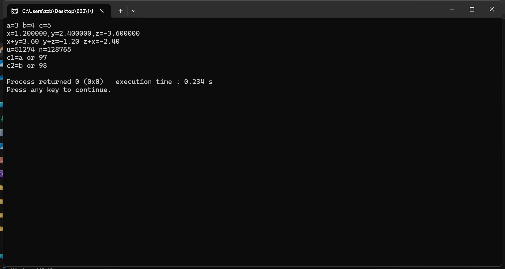
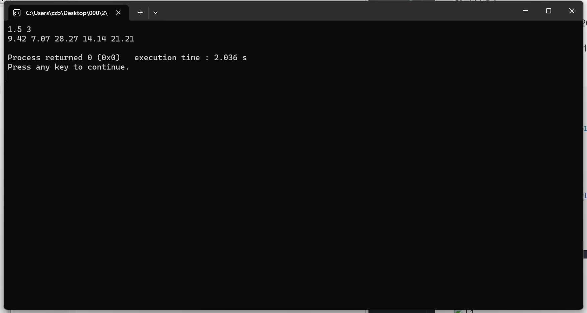
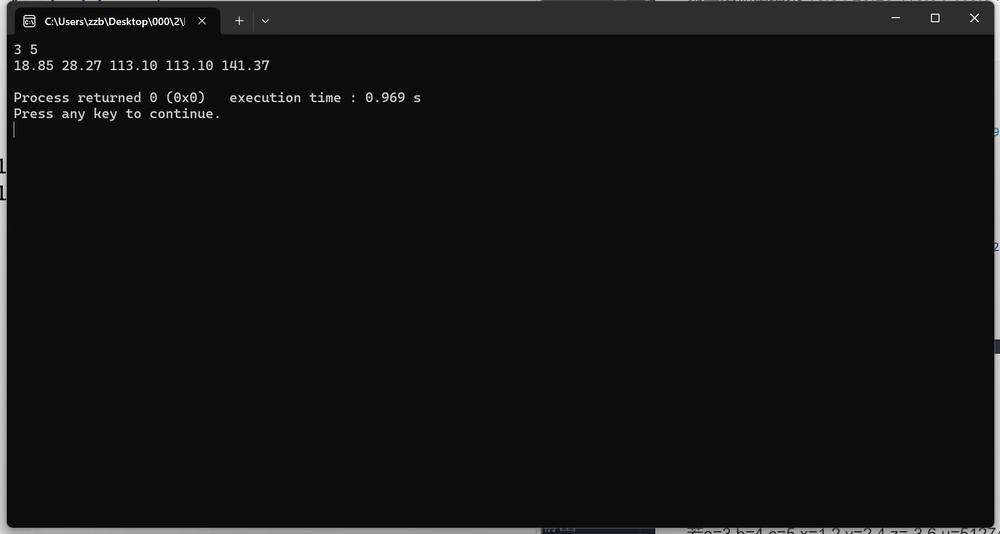
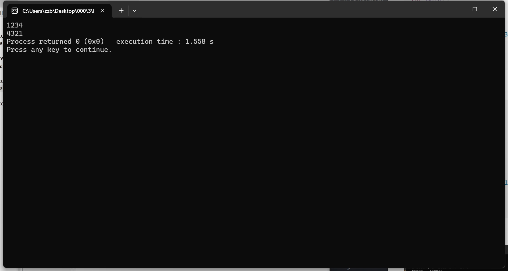
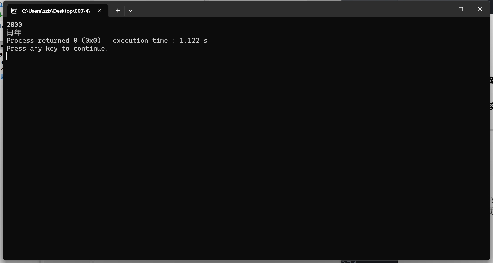
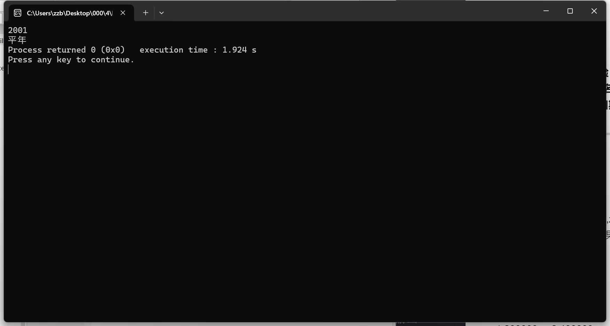

## <center> 实验报告 </center>

<table>
    <thead>
        <tr>
            <th align="left">课程名称:程序设计基础实验</th>
            <th></th>
            <th align="right">实验班级编号:15</th>
        </tr>
        <tr>
            <th align="left">班级:计算机二班</th>
            <th>姓名:张照博</th>
            <th align="right">学号:320240924771</th>
        </tr>
        <tr>
            <th align="left">指导教师:火克华</th>
            <th>实验日期:2024/10/15</th>
            <th align="right">邮箱:HobertZhang@outlook.com</th>
        </tr>
</table>

___

### 一.实验内容

#### 题目1

若 $ a=3,b=4,c=5,x=1.2,y=2.4,z=-3.6,u=51274,n=128765,c1='a',c2='b' $ 。想要得到以下的输出格式和结果，请写出程序（包括定义变量类型和设计输出）。

输出结果：
```
a=3 b=4 c=5
x=1.200000,y=2.400000,z=-3.600000
x+y= 3.60  y+z=-1.20  z+x=-2.40
u=51274  n=128765
c1=a or 97
c2=b or 98
```

###### 题目1程序代码

```cpp
#include <stdio.h>
#include <stdlib.h>
int a=3,b=4,c=5;
double x=1.2,y=2.4,z=-3.6;
int u=51274,n=128765;
char c1=97,c2=98;
int main()
{
    printf("a=%d b=%d c=%d\nx=%.6lf,y=%.6lf,z=%.6lf\n"
           "x+y=%.2lf y+z=%.2lf z+x=%.2lf\nu=%d n=%d\n"
           "c1=%c or %d\nc2=%c or %d\n",
           a,b,c,x,y,z,x+y,y+z,z+x,u,n,c1,c1,c2,c2);
    return 0;
}
```

###### 运行结果(截图)



#### 题目2

设圆半径为$r$，圆柱高$h$，求圆周长、圆面积、圆球表面积、圆球体积、圆柱体积。用scanf输入数据$r$、$h$，输出计算结果。输出时要有文字说明，取小数点后两位数字。

测试输入数据：

第一组输入数据  $r=1.5$ $h=3$;

第二组输入数据  $r=3$ $h=5$

参考答案：

   第一组输出结果 ``9.42 7.06 28.26 14.13 21.20``

   第二组输出结果  ``18.84 28.26 113.04 113.04 141.30``

###### 题目2程序代码

```cpp
#include <stdio.h>
#include <stdlib.h>
static const double pi=3.1415926535897932384626433832795028841971693993751;
double r,h;
int main()
{
    scanf("%lf %lf",&r,&h);
    printf("%.2lf %.2lf %.2lf %.2lf %.2lf\n",2*pi*r,pi*r*r,4*pi*r*r,pow(r,3)*pi*4/3,pi*r*r*h);
    return 0;
}

```

###### 运行结果(截图)




#### 题目3

输入一个四位数，分离出千位、百位、十位、个位，反转后输出

运行结果参考答案：

``1234``

``4321``

###### 题目3程序代码

**方案一**
直接读入字符串然后倒序输出
```cpp
#include <stdio.h>
#include <stdlib.h>
char c[8];
int main()
{
    scanf("%s",c);
    printf("%c%c%c%c",c[3],c[2],c[1],c[0]);
    return 0;
}
```
**方案二**
通过运算获得每一位的值，然后输出
```cpp
#include <stdio.h>
#include <stdlib.h>
int n;
int main()
{
    scanf("%d",&n);
    printf("%d%d%d%d",n%10,n/10%10,n/100%10,n/1000%10);
    return 0;
}
```

###### 运行结果(截图)



#### 题目4

输入一个年份的数字，判断并输出是否为闰年。

运行结果参考答案1：输入： $ 2000 $   输出：``闰年``

运行结果参考答案2：输入： $ 2001 $   输出：``平年``

###### 题目4程序代码

```cpp
#include <stdio.h>
#include <stdlib.h>
#include <stdbool.h>
///在C语言中使用bool类型,该头文件提供了数个有关宏定义
int n;///对于天文纪年存在负数表示公元前
bool is_leap(int n)
{
    return (n%4)?0:(n%100)?1:(n%400)?0:1;
}
int main()
{
    scanf("%d",&n);
    printf(is_leap(n)?"闰年":"平年");
    return 0;
}

```

###### 运行结果(截图)



